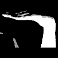
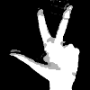
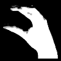
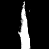
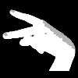
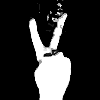
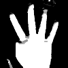
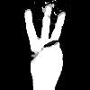

# Gesture-Recognition-using-background-elimination

## Introduction:

The problem of human computer interaction has been everlasting since the advent of computers. Terminals, promts, GUI all do fair job satisfying this, yet there is major void left unattended that limits the efficiency and performace of human-computer based tasks. The introducton of CNNs in Machine Learning has opened up a whole new era of possiblities to address the above problem. Though existing traditional image processing techniques through kinect sensors do a commendable job, they often tend to be costly and inaccessible to various sectors. Hence, we propose the usage of a CNN for the control of various tasks using simple hand gestures which seems to be a more natural and comfortable way for humans to interact with machines.

### A Brief Overview:
This project has two parts:
### 1) using dynamic gestures for controlling a robot's movements.

### 2) using gestures for performing various activities on computer screen.

The full video can be watched here:
https://www.youtube.com/watch?v=Ia0tjqW7xKA

### The following is a table of allowed Gestures:

  |   | 
:-------------------------:|:-------------------------:|:-------------------------:
  |   | 
  |   | 
  |   | 
  |   | 
  |   | 
  |   | 
  |   | 
  |  

## Real Life Applications:
1) Telepresence through robots:
- Cases like Hazard managemet, disaster recovery, Space navigation and exploration, etc.
- In short use cases where a human's presence/touch is needed, yet too risky or economically infeasible.
  
2) Enhancing the comunication capabilities of hearing and speech impaired:
- Clubbing the Standard Hand gestures with various vernacular languages to promote smooth interaction with the general public.

## Conclusion:
Cutting the cost overhead on sophosticated sensors and equipments has enhanced the accesibility of our project to a great extent.The relatively simple yet effective structure prove to be more robust and versatile in its applications. Thus we expect the deployment of our project in various real-life cases so as to improve and accelerate the pace of human development so as to enhance the standard of our lives and move towards a sustainable future.
